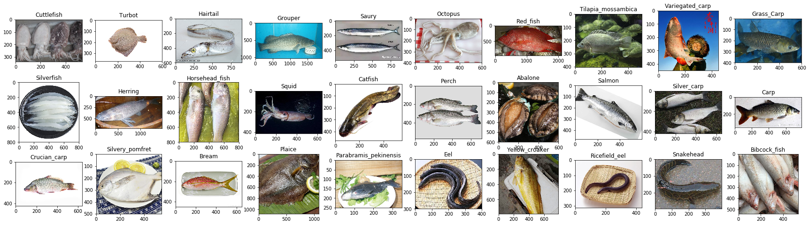
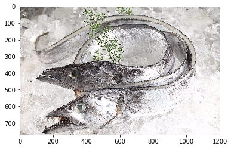
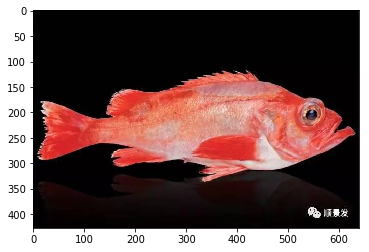
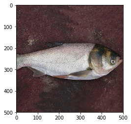
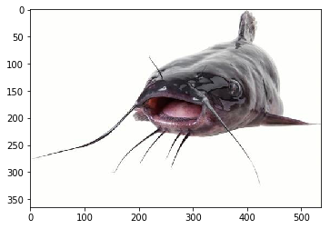

# 基于PaddleHub实现常见鱼类分类及微信小程序部署

> 针对以上30种常见鱼类进行分类，并部署到微信小程序

# 一、项目背景
## 1.1项目由来
<center>在菜市场或者一些美食类视频中我们经常能够看到鱼的出现，</center>
<center>但是由于本身不怎么做菜的原因，对于一些常见的食用鱼类并不是很熟悉，</center>
<center>为了能够认识这些常见鱼类,并成功购买到它们，</center>
<center>我们有必要对一些常见的鱼类进行准确的识别。</center>
<center>本项目中，我们通过爬取百度图片、百度百科、电商平台等，收集了<strong>30种</strong>常见的鱼类图片,</center>
<center>并部署到微信小程序，方便后续的使用</center>

## 1.2微信小程序鱼类识别截图


# 二、数据集简介
包含30类常见鱼类，合计1917张图片，由于有部分鱼类爬取到的图片数量较少，因此每种鱼类的数据量并不是一致的。
<br>
<strong>友情提示：数据集仅供学习和个人使用</strong>
<br>
30种鱼类中英文对照字典：
<br>
{'Cuttlefish': '墨鱼',
 'Turbot': '多宝鱼',
 'Hairtail': '带鱼',
 'Grouper': '石斑鱼',
 'Saury': '秋刀鱼',
 'Octopus': '章鱼',
 'Red_fish': '红鱼',
 'Tilapia_mossambica': '罗非鱼',
 'Variegated_carp': '胖头鱼',
 'Grass_Carp': '草鱼',
 'Silverfish': '银鱼',
 'Herring': '青鱼',
 'Horsehead_fish': '马头鱼',
 'Squid': '鱿鱼',
 'Catfish': '鲇鱼',
 'Perch': '鲈鱼',
 'Abalone': '鲍鱼',
 'Salmon': '鲑鱼',
 'Silver_carp': '鲢鱼',
 'Carp': '鲤鱼',
 'Crucian_carp': '鲫鱼',
 'Silvery_pomfret': '鲳鱼',
 'Bream': '鲷鱼',
 'Plaice': '鲽鱼',
 'Parabramis_pekinensis': '鳊鱼',
 'Eel': '鳗鱼',
 'Yellow_croaker': '黄鱼',
 'Ricefield_eel': '黄鳝',
 'Snakehead': '黑鱼',
 'Bibcock_fish': '龙头鱼'}
 

## 2.1.数据加载和预处理


```python
# 解压缩数据
!unzip -oq -d images data/data103322/images.zip
```


```python
# 数据加载和预处理
import os
import paddle
import numpy as np
import paddlehub.vision.transforms as T

# 定义数据集
class FishDataset(paddle.io.Dataset):
    def __init__(self, dataset_dir, transforms, mode='train'):
        # 数据集存放路径
        self.dataset_dir = dataset_dir
        # 数据增强
        self.transforms = transforms
        # 分类数
        self.label_lst = []
        self.num_classes= self.get_label()
        self.mode = mode
        # 根据mode读取对应的数据集
        if self.mode == 'train':
            self.file = 'train_list.txt'
        elif self.mode == 'test':
            self.file = 'test_list.txt'
        else:
            self.file = 'validate_list.txt'
        self.file = os.path.join(self.dataset_dir, self.file)
        with open(self.file, 'r') as f:
            self.data = f.read().split('\n')[:-1]
    
    def get_label(self):
        # 获取分类数
        with open(os.path.join(dataset_dir, 'label_list.txt'), 'r') as f:
            labels = f.readlines()
        for idx, label in enumerate(labels):
            dic = {}
            dic['label_name'] = label.split('\n')[0]
            dic['label_id'] = idx
            self.label_lst.append(dic)
        return len(self.label_lst)

    def __getitem__(self, idx):
        img_path, label = self.data[idx].split(' ')
        img_path = os.path.join(self.dataset_dir, img_path)
        im = self.transforms(img_path)
        return im, int(label)
    
    def __len__(self):
        return len(self.data)

# 定义数据增强
train_Transforms = T.Compose([
                T.Resize((256, 256)),
                T.CenterCrop(224),
                T.RandomHorizontalFlip(),
                T.Normalize()
                ], to_rgb=True)
eval_Transforms = T.Compose([
                T.Resize((256, 256)),
                T.CenterCrop(224),
                T.Normalize()
                ], to_rgb=True)
# 读取数据集
dataset_dir = 'images/images'
fish_train = FishDataset(dataset_dir, train_Transforms)
fish_validate = FishDataset(dataset_dir, eval_Transforms, mode='validate')

print('训练集的图片数量: {}'.format(len(fish_train)))
print('验证集的图片数量: {}'.format(len(fish_validate)))
print('分类数: {}'.format(len(fish_train.label_lst)))
```

    /opt/conda/envs/python35-paddle120-env/lib/python3.7/site-packages/matplotlib/__init__.py:107: DeprecationWarning: Using or importing the ABCs from 'collections' instead of from 'collections.abc' is deprecated, and in 3.8 it will stop working
      from collections import MutableMapping
    /opt/conda/envs/python35-paddle120-env/lib/python3.7/site-packages/matplotlib/rcsetup.py:20: DeprecationWarning: Using or importing the ABCs from 'collections' instead of from 'collections.abc' is deprecated, and in 3.8 it will stop working
      from collections import Iterable, Mapping
    /opt/conda/envs/python35-paddle120-env/lib/python3.7/site-packages/matplotlib/colors.py:53: DeprecationWarning: Using or importing the ABCs from 'collections' instead of from 'collections.abc' is deprecated, and in 3.8 it will stop working
      from collections import Sized


    训练集的图片数量: 1353
    验证集的图片数量: 386
    分类数: 30


```python
# label_id转label
id2label = {}
for i in fish_train.label_lst:
     id2label[i['label_id']] = i['label_name']
print(id2label)
```

    {0: 'Cuttlefish', 1: 'Turbot', 2: 'Hairtail', 3: 'Grouper', 4: 'Saury', 5: 'Octopus', 6: 'Red_fish', 7: 'Tilapia_mossambica', 8: 'Variegated_carp', 9: 'Grass_Carp', 10: 'Silverfish', 11: 'Herring', 12: 'Horsehead_fish', 13: 'Squid', 14: 'Catfish', 15: 'Perch', 16: 'Abalone', 17: 'Salmon', 18: 'Silver_carp', 19: 'Carp', 20: 'Crucian_carp', 21: 'Silvery_pomfret', 22: 'Bream', 23: 'Plaice', 24: 'Parabramis_pekinensis', 25: 'Eel', 26: 'Yellow_croaker', 27: 'Ricefield_eel', 28: 'Snakehead', 29: 'Bibcock_fish'}


```python
# 鱼类英文名转中文
en2zh = {'Cuttlefish': '墨鱼', 'Turbot': '多宝鱼', 'Hairtail': '带鱼', 'Grouper': '石斑鱼', 'Saury': '秋刀鱼', 'Octopus': '章鱼', 'Red_fish': '红鱼', 'Tilapia_mossambica': '罗非鱼', 'Variegated_carp': '胖头鱼', 'Grass_Carp': '草鱼', 'Silverfish': '银鱼', 'Herring': '青鱼', 'Horsehead_fish': '马头鱼', 'Squid': '鱿鱼', 'Catfish': '鲇鱼', 'Perch': '鲈鱼', 'Abalone': '鲍鱼', 'Salmon': '鲑鱼', 'Silver_carp': '鲢鱼', 'Carp': '鲤鱼', 'Crucian_carp': '鲫鱼', 'Silvery_pomfret': '鲳鱼', 'Bream': '鲷鱼', 'Plaice': '鲽鱼', 'Parabramis_pekinensis': '鳊鱼', 'Eel': '鳗鱼', 'Yellow_croaker': '黄鱼', 'Ricefield_eel': '黄鳝', 'Snakehead': '黑鱼', 'Bibcock_fish': '龙头鱼'}
print(en2zh)
```

    {'Cuttlefish': '墨鱼', 'Turbot': '多宝鱼', 'Hairtail': '带鱼', 'Grouper': '石斑鱼', 'Saury': '秋刀鱼', 'Octopus': '章鱼', 'Red_fish': '红鱼', 'Tilapia_mossambica': '罗非鱼', 'Variegated_carp': '胖头鱼', 'Grass_Carp': '草鱼', 'Silverfish': '银鱼', 'Herring': '青鱼', 'Horsehead_fish': '马头鱼', 'Squid': '鱿鱼', 'Catfish': '鲇鱼', 'Perch': '鲈鱼', 'Abalone': '鲍鱼', 'Salmon': '鲑鱼', 'Silver_carp': '鲢鱼', 'Carp': '鲤鱼', 'Crucian_carp': '鲫鱼', 'Silvery_pomfret': '鲳鱼', 'Bream': '鲷鱼', 'Plaice': '鲽鱼', 'Parabramis_pekinensis': '鳊鱼', 'Eel': '鳗鱼', 'Yellow_croaker': '黄鱼', 'Ricefield_eel': '黄鳝', 'Snakehead': '黑鱼', 'Bibcock_fish': '龙头鱼'}


## 2.2数据集查看


```python
from PIL import Image
import matplotlib.pyplot as plt

path = 'images/images/train'
plt.figure(figsize=(30, 8))
for idx, name in enumerate(en2zh.keys()):
    for fpath, dirname, fname in os.walk(os.path.join(path, name)):
        plt.subplot(3, 10, idx+1)
        img = Image.open(os.path.join(fpath, fname[0]))
        plt.title(name)
        plt.imshow(img)
```





# 三、模型选择和开发

## 3.1.模型选择


```python
import paddle
from paddle.vision.models import resnet50

# 设置pretrained参数为True，可以加载resnet50在imagenet数据集上的预训练模型
model = paddle.Model(resnet50(pretrained=True, num_classes=len(fish_train.label_lst)))
```

## 3.2模型训练


```python
from paddle.optimizer import Momentum
from paddle.regularizer import L2Decay
from paddle.nn import CrossEntropyLoss
from paddle.metric import Accuracy

# 配置优化器
optimizer = Momentum(learning_rate=0.001,
                     momentum=0.9,
                     weight_decay=L2Decay(1e-4),
                     parameters=model.parameters())
# 进行训练前准备
model.prepare(optimizer, CrossEntropyLoss(), Accuracy(topk=(1, 5)))
# 启动训练
model.fit(fish_train,
          fish_validate,
          epochs=50,
          batch_size=8,
          save_dir="./output")
```

    save checkpoint at /home/aistudio/output/final


```python
if not os.path.exists('final'):
    os.mkdir('final')
# 将final.pdparams复制到final文件夹
!cp output/final.pdparams final
```

## 3.3模型评估测试


```python
# 模型评估，根据prepare接口配置的loss和metric进行返回
result = model.evaluate(fish_validate)
print(result)
```

    Eval begin...
    step  10/386 - loss: 2.5034e-06 - acc_top1: 0.9000 - acc_top5: 0.9000 - 30ms/step
    step  20/386 - loss: 8.0463e-05 - acc_top1: 0.9000 - acc_top5: 0.9500 - 29ms/step
    step  30/386 - loss: 6.5565e-06 - acc_top1: 0.9000 - acc_top5: 0.9667 - 30ms/step
    step  40/386 - loss: 0.0016 - acc_top1: 0.9250 - acc_top5: 0.9750 - 29ms/step
    step  50/386 - loss: 0.0429 - acc_top1: 0.9000 - acc_top5: 0.9600 - 28ms/step
    step  60/386 - loss: 1.5174e-04 - acc_top1: 0.9167 - acc_top5: 0.9667 - 28ms/step
    step  70/386 - loss: 0.0011 - acc_top1: 0.9000 - acc_top5: 0.9714 - 28ms/step
    step  80/386 - loss: 2.1696e-05 - acc_top1: 0.9000 - acc_top5: 0.9625 - 27ms/step
    step  90/386 - loss: 0.0059 - acc_top1: 0.9111 - acc_top5: 0.9667 - 27ms/step
    step 100/386 - loss: 2.4080e-05 - acc_top1: 0.9100 - acc_top5: 0.9700 - 27ms/step
    step 110/386 - loss: 8.9999e-05 - acc_top1: 0.9091 - acc_top5: 0.9727 - 27ms/step
    step 120/386 - loss: 0.0066 - acc_top1: 0.9083 - acc_top5: 0.9750 - 27ms/step
    step 130/386 - loss: 1.7047e-05 - acc_top1: 0.9077 - acc_top5: 0.9769 - 28ms/step
    step 140/386 - loss: 9.4715e-04 - acc_top1: 0.9143 - acc_top5: 0.9786 - 28ms/step
    step 150/386 - loss: 1.9312e-05 - acc_top1: 0.9200 - acc_top5: 0.9800 - 28ms/step
    step 160/386 - loss: 0.0306 - acc_top1: 0.9187 - acc_top5: 0.9812 - 28ms/step
    step 170/386 - loss: 0.0046 - acc_top1: 0.9235 - acc_top5: 0.9824 - 28ms/step
    step 180/386 - loss: 3.3020e-05 - acc_top1: 0.9167 - acc_top5: 0.9833 - 28ms/step
    step 190/386 - loss: 5.9605e-07 - acc_top1: 0.9211 - acc_top5: 0.9842 - 28ms/step
    step 200/386 - loss: 3.7908e-05 - acc_top1: 0.9250 - acc_top5: 0.9850 - 28ms/step
    step 210/386 - loss: 0.0020 - acc_top1: 0.9286 - acc_top5: 0.9857 - 28ms/step
    step 220/386 - loss: 9.5367e-07 - acc_top1: 0.9182 - acc_top5: 0.9818 - 28ms/step
    step 230/386 - loss: 0.8255 - acc_top1: 0.9130 - acc_top5: 0.9826 - 28ms/step
    step 240/386 - loss: 6.0080e-05 - acc_top1: 0.9125 - acc_top5: 0.9833 - 28ms/step
    step 250/386 - loss: 0.0066 - acc_top1: 0.9040 - acc_top5: 0.9840 - 28ms/step
    step 260/386 - loss: 9.6316e-05 - acc_top1: 0.9000 - acc_top5: 0.9846 - 28ms/step
    step 270/386 - loss: 3.5763e-06 - acc_top1: 0.9037 - acc_top5: 0.9852 - 28ms/step
    step 280/386 - loss: 3.2977 - acc_top1: 0.8929 - acc_top5: 0.9786 - 28ms/step
    step 290/386 - loss: 5.3644e-06 - acc_top1: 0.8931 - acc_top5: 0.9759 - 27ms/step
    step 300/386 - loss: 2.3842e-07 - acc_top1: 0.8967 - acc_top5: 0.9767 - 27ms/step
    step 310/386 - loss: 0.8080 - acc_top1: 0.8968 - acc_top5: 0.9774 - 27ms/step
    step 320/386 - loss: 5.7220e-06 - acc_top1: 0.9000 - acc_top5: 0.9781 - 27ms/step
    step 330/386 - loss: 4.1655e-04 - acc_top1: 0.8939 - acc_top5: 0.9758 - 27ms/step
    step 340/386 - loss: 2.7895e-05 - acc_top1: 0.8941 - acc_top5: 0.9765 - 27ms/step
    step 350/386 - loss: 5.3285e-05 - acc_top1: 0.8943 - acc_top5: 0.9771 - 27ms/step
    step 360/386 - loss: 0.0021 - acc_top1: 0.8972 - acc_top5: 0.9778 - 27ms/step
    step 370/386 - loss: 1.5497e-06 - acc_top1: 0.9000 - acc_top5: 0.9784 - 27ms/step
    step 380/386 - loss: 7.9870e-06 - acc_top1: 0.9026 - acc_top5: 0.9789 - 27ms/step
    step 386/386 - loss: 0.0017 - acc_top1: 0.9041 - acc_top5: 0.9793 - 27ms/step
    Eval samples: 386
    {'loss': [0.0016633736], 'acc_top1': 0.9041450777202072, 'acc_top5': 0.9792746113989638}


## 3.4.模型预测


```python
# 批量预测
from paddle.static import InputSpec

# 加载final模型参数
inputs = InputSpec([None, 1*1*3*224*224], 'float32', 'x')
labels = InputSpec([None, 30], 'int32', 'x')
model = paddle.Model(resnet50(num_classes=len(fish_train.label_lst)), inputs, labels)
# 加载模型参数
model.load('final/final.pdparams')
# 定义优化器
optimizer = Momentum(learning_rate=0.001,
                     momentum=0.9,
                     weight_decay=L2Decay(1e-4),
                     parameters=model.parameters())
# 进行预测前准备
model.prepare(optimizer, CrossEntropyLoss(), Accuracy(topk=(1, 5)))
# 加载测试集数据
fish_test = FishDataset(dataset_dir, eval_Transforms, mode='test')
# 进行预测操作
result = model.predict(fish_test)
# 定义画图方法
def show_img(idx, predict):
    with open(os.path.join(dataset_dir, 'test_list.txt')) as f:
        data = f.readlines()
    plt.figure()
    print('predict: {}'.format(predict))
    img = Image.open(os.path.join(dataset_dir, data[idx].split()[0]))
    plt.imshow(img)
    plt.show()
# 抽样展示
indexs = [2, 15, 38, 100]
for idx in indexs:
    show_img(idx, en2zh[id2label[np.argmax(result[0][idx])]])
```

    Predict begin...
    step 178/178 [==============================] - ETA: 5s - 33ms/ste - ETA: 5s - 30ms/ste - ETA: 4s - 28ms/ste - ETA: 4s - 28ms/ste - ETA: 4s - 27ms/ste - ETA: 4s - 27ms/ste - ETA: 4s - 27ms/ste - ETA: 4s - 27ms/ste - ETA: 4s - 27ms/ste - ETA: 4s - 27ms/ste - ETA: 4s - 27ms/ste - ETA: 4s - 27ms/ste - ETA: 4s - 27ms/ste - ETA: 3s - 27ms/ste - ETA: 3s - 27ms/ste - ETA: 3s - 27ms/ste - ETA: 3s - 27ms/ste - ETA: 3s - 27ms/ste - ETA: 3s - 27ms/ste - ETA: 3s - 27ms/ste - ETA: 3s - 27ms/ste - ETA: 3s - 27ms/ste - ETA: 3s - 27ms/ste - ETA: 3s - 27ms/ste - ETA: 3s - 27ms/ste - ETA: 3s - 27ms/ste - ETA: 3s - 27ms/ste - ETA: 3s - 27ms/ste - ETA: 3s - 27ms/ste - ETA: 3s - 27ms/ste - ETA: 3s - 27ms/ste - ETA: 3s - 27ms/ste - ETA: 3s - 27ms/ste - ETA: 2s - 27ms/ste - ETA: 2s - 27ms/ste - ETA: 2s - 27ms/ste - ETA: 2s - 27ms/ste - ETA: 2s - 27ms/ste - ETA: 2s - 27ms/ste - ETA: 2s - 27ms/ste - ETA: 2s - 27ms/ste - ETA: 2s - 27ms/ste - ETA: 2s - 27ms/ste - ETA: 2s - 27ms/ste - ETA: 2s - 27ms/ste - ETA: 2s - 27ms/ste - ETA: 2s - 28ms/ste - ETA: 2s - 28ms/ste - ETA: 2s - 28ms/ste - ETA: 2s - 28ms/ste - ETA: 2s - 28ms/ste - ETA: 2s - 28ms/ste - ETA: 2s - 28ms/ste - ETA: 1s - 28ms/ste - ETA: 1s - 28ms/ste - ETA: 1s - 28ms/ste - ETA: 1s - 28ms/ste - ETA: 1s - 28ms/ste - ETA: 1s - 28ms/ste - ETA: 1s - 29ms/ste - ETA: 1s - 29ms/ste - ETA: 1s - 29ms/ste - ETA: 1s - 29ms/ste - ETA: 1s - 29ms/ste - ETA: 1s - 29ms/ste - ETA: 1s - 29ms/ste - ETA: 1s - 29ms/ste - ETA: 1s - 29ms/ste - ETA: 1s - 29ms/ste - ETA: 1s - 29ms/ste - ETA: 1s - 29ms/ste - ETA: 0s - 29ms/ste - ETA: 0s - 29ms/ste - ETA: 0s - 29ms/ste - ETA: 0s - 29ms/ste - ETA: 0s - 29ms/ste - ETA: 0s - 29ms/ste - ETA: 0s - 29ms/ste - ETA: 0s - 29ms/ste - ETA: 0s - 29ms/ste - ETA: 0s - 29ms/ste - ETA: 0s - 28ms/ste - ETA: 0s - 28ms/ste - ETA: 0s - 29ms/ste - ETA: 0s - 29ms/ste - ETA: 0s - 28ms/ste - ETA: 0s - 28ms/ste - ETA: 0s - 28ms/ste - 28ms/step          
    Predict samples: 178
    predict: 墨鱼


    predict: 带鱼





    predict: 红鱼





    predict: 鲢鱼





```python
# 单张图片预测
# 读取单张图片
image = paddle.to_tensor(fish_test[80][0]).reshape([1, 1, 3, 224, 224])
image_id = 80

# 单张图片预测
result = model.predict(image)

# 可视化结果
show_img(image_id, en2zh[id2label[np.argmax(result)]])
```

    Predict begin...
    step 1/1 [==============================] - 29ms/step
    Predict samples: 1
    predict: 鲇鱼





# 四、基于PaddleHub Serving进行微信小程序部署
内容根据PaddleHub文档[教程>如何创建自己的Module](https://paddlehub.readthedocs.io/zh_CN/release-v2.1/tutorial/custom_module.html)改编。文档基于情感分类（NLP）模型，本文基于（CV），开发者可根据需要相互参考。

## 4.1创建必要的目录和文件
在 `/home/aistudio/work` 目录下创建 `fish_predict` 文件夹，并在该目录下分别创建 `module.py` `__init__.py` ，其中 `module.py` 作为 **Module** 的入口，用来实现逻辑预测功能。


```python
! tree work/
```

    work/
    └── fish_predict
        ├── __init__.py
        └── module.py
    
    1 directory, 2 files


## 4.2. 修改 module.py 文件
hub模型的转换基于我们在此之前写过的代码，通过对其进行包装修饰得到所需的 `module.py` 文件。

<!DOCTYPE html>
<html lang="en">

<head>
  <meta charset="UTF-8">
  <meta http-equiv="X-UA-Compatible" content="IE=edge">
  <meta name="viewport" content="width=device-width, initial-scale=1.0">
</head>

<body>
  <details>
    <summary style="font-size:20px;color:#f00;cursor:pointer;">查看module.py代码</summary>
    
        import paddle
        import numpy as np
        import argparse
        import os
        from PIL import Image
        import base64
        from io import BytesIO
        import json
        import paddlehub as hub
        from paddlehub.module.module import runnable, moduleinfo, serving
        import paddlehub.vision.transforms as T
        from paddle.vision.models import resnet50
        from paddle.optimizer import Momentum
        from paddle.regularizer import L2Decay
        from paddle.nn import CrossEntropyLoss
        from paddle.metric import Accuracy
        from paddle.static import InputSpec


        testTransforms = T.Compose([
                        T.Resize((256, 256)),
                        T.CenterCrop(224),
                        T.Normalize()
                        ], to_rgb=True)
        # 读取一张本地的样例图片，转变成模型输入的格式
        def load_image(img_path, transforms):
            im = transforms(img_path)
            return im

        # 将requests请求发来的图像数据，转变成模型输入的格式
        def load_image_requests(img, transforms):
            im = Image.open(img)
            im = transforms(np.array(im))
            return im

        # label_id转label
        id2label = {0: 'Cuttlefish', 1: 'Turbot', 2: 'Hairtail', 3: 'Grouper', 4: 'Saury', 5: 'Octopus', 6: 'Red_fish', 7: 'Tilapia_mossambica', 8: 'Variegated_carp', 9: 'Grass_Carp', 10: 'Silverfish', 11: 'Herring', 12: 'Horsehead_fish', 13: 'Squid', 14: 'Catfish', 15: 'Perch', 16: 'Abalone', 17: 'Salmon', 18: 'Silver_carp', 19: 'Carp', 20: 'Crucian_carp', 21: 'Silvery_pomfret', 22: 'Bream', 23: 'Plaice', 24: 'Parabramis_pekinensis', 25: 'Eel', 26: 'Yellow_croaker', 27: 'Ricefield_eel', 28: 'Snakehead', 29: 'Bibcock_fish'}
        imgs = ['墨鱼', '多宝鱼', '带鱼', '石斑鱼', '秋刀鱼', '章鱼', '红鱼', '罗非鱼', '胖头鱼', '草鱼', '银鱼', '青鱼', '马头鱼', '鱿鱼', '鲇鱼', '鲈鱼', '鲍鱼', '鲑鱼', '鲢鱼', '鲤鱼', '鲫鱼', '鲳鱼', '鲷鱼', '鲽鱼', '鳊鱼', '鳗鱼', '黄鱼', '黄鳝', '黑鱼', '龙头鱼']
        imgs_name = ['Cuttlefish', 'Turbot', 'Hairtail', 'Grouper', 'Saury', 'Octopus', 'Red_fish', 'Tilapia_mossambica',
                     'Variegated_carp', 'Grass_Carp', 'Silverfish', 'Herring', 'Horsehead_fish', 'Squid', 'Catfish',
                     'Perch', 'Abalone', 'Salmon', 'Silver_carp', 'Carp', 'Crucian_carp', 'Silvery_pomfret', 'Bream',              
                     'Plaice', 'Parabramis_pekinensis','Eel', 'Yellow_croaker', 'Ricefield_eel', 'Snakehead', 
                     'Bibcock_fish']
        en2ch = {}
        ch2en = {}
        for i, j in zip(imgs_name, imgs):
            en2ch[i] = j
            ch2en[j] = i

        @moduleinfo(
            name="fish_predict",
            version="1.0.0",
            summary="This is a PaddleHub Module. Just for fish predict.",
            author="mofei629",
            author_email="",
            type="cv/fish_predict",
        )
        class FishPredict:
            def __init__(self):
                self.parser = argparse.ArgumentParser(
                    description="Run the fish_predict module.",
                    prog='hub run fish_predict',
                    usage='%(prog)s',
                    add_help=True)
                self.parser.add_argument(
                    '--input_img', type=str, default=None, help="img to predict")
                

            def fish_predict(self, img_path):
                print('forward')
                # model.eval()
                tensor_img = load_image(img_path, testTransforms)
                paddle.disable_static()
                result = model.predict(paddle.to_tensor(tensor_img).reshape([1, 1, 3, 224, 224]))

                # return result.numpy().astype('int32')
                return id2label[np.argmax(result)]
            
            @runnable
            def runnable(self, argvs):
                print('runnable')
                args = self.parser.parse_args(argvs)

                return self.fish_predict(args.input_img)

            @serving
            def serving(self, img_b64):
                print('serving')
                # model.eval()
                img_b = base64.b64decode(img_b64)
                tensor_img = load_image_requests(BytesIO(img_b), testTransforms)
                paddle.disable_static()
                print(tensor_img.shape)
                result = model.predict(paddle.to_tensor(tensor_img).reshape([1, 1, 3, 224, 224]))

                # 应该返回JSON格式数据
                # 从numpy读出的数据格式是 numpy.int32
                res = { 'res': en2ch[id2label[np.argmax(result)]] }
                return json.dumps(res)

        # 实例化全局
        inputs = InputSpec([None, 1*1*3*224*224], 'float32', 'x')
        labels = InputSpec([None, 30], 'int32', 'x')
        model = paddle.Model(resnet50(num_classes=30), inputs, labels)
        # 加载模型参数
        model.load('/home/aistudio/final/final.pdparams')
        # 定义优化器
        optimizer = Momentum(learning_rate=0.001,
                             momentum=0.9,
                             weight_decay=L2Decay(1e-4),
                             parameters=model.parameters())
        # 进行预测前准备
        model.prepare(optimizer, CrossEntropyLoss(), Accuracy(topk=(1, 5)))

        my_fish_predict = FishPredict()
  </details>
</body>

</html>

## 4.3 安装模型及预测
在 module.py 中编写好代码后，就可以通过 hub install xxx 的方式来安装模型了！


```python
!pip install --upgrade paddlehub
```

    Looking in indexes: https://mirror.baidu.com/pypi/simple/
    Collecting paddlehub
    [?25l  Downloading https://mirror.baidu.com/pypi/packages/7a/29/3bd0ca43c787181e9c22fe44b944b64d7fcb14ce66d3bf4602d9ad2ac76c/paddlehub-2.1.0-py3-none-any.whl (211kB)
         |████████████████████████████████| 215kB 21.5MB/s eta 0:00:01
    [?25hRequirement already satisfied, skipping upgrade: rarfile in /opt/conda/envs/python35-paddle120-env/lib/python3.7/site-packages (from paddlehub) (3.1)
    Requirement already satisfied, skipping upgrade: Pillow in /opt/conda/envs/python35-paddle120-env/lib/python3.7/site-packages (from paddlehub) (7.1.2)
    Requirement already satisfied, skipping upgrade: filelock in /opt/conda/envs/python35-paddle120-env/lib/python3.7/site-packages (from paddlehub) (3.0.12)
    Requirement already satisfied, skipping upgrade: colorlog in /opt/conda/envs/python35-paddle120-env/lib/python3.7/site-packages (from paddlehub) (4.1.0)
    Requirement already satisfied, skipping upgrade: tqdm in /opt/conda/envs/python35-paddle120-env/lib/python3.7/site-packages (from paddlehub) (4.36.1)
    Requirement already satisfied, skipping upgrade: paddlenlp>=2.0.0rc5 in /opt/conda/envs/python35-paddle120-env/lib/python3.7/site-packages (from paddlehub) (2.0.7)
    Requirement already satisfied, skipping upgrade: pyyaml in /opt/conda/envs/python35-paddle120-env/lib/python3.7/site-packages (from paddlehub) (5.1.2)
    Requirement already satisfied, skipping upgrade: easydict in /opt/conda/envs/python35-paddle120-env/lib/python3.7/site-packages (from paddlehub) (1.9)
    Requirement already satisfied, skipping upgrade: opencv-python in /opt/conda/envs/python35-paddle120-env/lib/python3.7/site-packages (from paddlehub) (4.1.1.26)
    Requirement already satisfied, skipping upgrade: packaging in /opt/conda/envs/python35-paddle120-env/lib/python3.7/site-packages (from paddlehub) (20.9)
    Requirement already satisfied, skipping upgrade: pyzmq in /opt/conda/envs/python35-paddle120-env/lib/python3.7/site-packages (from paddlehub) (18.1.1)
    Requirement already satisfied, skipping upgrade: visualdl>=2.0.0 in /opt/conda/envs/python35-paddle120-env/lib/python3.7/site-packages (from paddlehub) (2.2.0)
    Requirement already satisfied, skipping upgrade: colorama in /opt/conda/envs/python35-paddle120-env/lib/python3.7/site-packages (from paddlehub) (0.4.4)
    Requirement already satisfied, skipping upgrade: gitpython in /opt/conda/envs/python35-paddle120-env/lib/python3.7/site-packages (from paddlehub) (3.1.14)
    Requirement already satisfied, skipping upgrade: flask>=1.1.0 in /opt/conda/envs/python35-paddle120-env/lib/python3.7/site-packages (from paddlehub) (1.1.1)
    Requirement already satisfied, skipping upgrade: gunicorn>=19.10.0; sys_platform != "win32" in /opt/conda/envs/python35-paddle120-env/lib/python3.7/site-packages (from paddlehub) (20.0.4)
    Requirement already satisfied, skipping upgrade: matplotlib in /opt/conda/envs/python35-paddle120-env/lib/python3.7/site-packages (from paddlehub) (2.2.3)
    Requirement already satisfied, skipping upgrade: numpy in /opt/conda/envs/python35-paddle120-env/lib/python3.7/site-packages (from paddlehub) (1.20.3)
    Collecting paddle2onnx>=0.5.1 (from paddlehub)
    [?25l  Downloading https://mirror.baidu.com/pypi/packages/37/80/aa6134b5f36aea45dc1b363e7af941dccabe4d7e167ac391ff046f34baf1/paddle2onnx-0.7-py3-none-any.whl (94kB)
         |████████████████████████████████| 102kB 23.6MB/s ta 0:00:01
    [?25hRequirement already satisfied, skipping upgrade: multiprocess in /opt/conda/envs/python35-paddle120-env/lib/python3.7/site-packages (from paddlenlp>=2.0.0rc5->paddlehub) (0.70.11.1)
    Requirement already satisfied, skipping upgrade: seqeval in /opt/conda/envs/python35-paddle120-env/lib/python3.7/site-packages (from paddlenlp>=2.0.0rc5->paddlehub) (1.2.2)
    Requirement already satisfied, skipping upgrade: jieba in /opt/conda/envs/python35-paddle120-env/lib/python3.7/site-packages (from paddlenlp>=2.0.0rc5->paddlehub) (0.42.1)
    Requirement already satisfied, skipping upgrade: h5py in /opt/conda/envs/python35-paddle120-env/lib/python3.7/site-packages (from paddlenlp>=2.0.0rc5->paddlehub) (2.9.0)
    Requirement already satisfied, skipping upgrade: pyparsing>=2.0.2 in /opt/conda/envs/python35-paddle120-env/lib/python3.7/site-packages (from packaging->paddlehub) (2.4.2)
    Requirement already satisfied, skipping upgrade: Flask-Babel>=1.0.0 in /opt/conda/envs/python35-paddle120-env/lib/python3.7/site-packages (from visualdl>=2.0.0->paddlehub) (1.0.0)
    Requirement already satisfied, skipping upgrade: protobuf>=3.11.0 in /opt/conda/envs/python35-paddle120-env/lib/python3.7/site-packages (from visualdl>=2.0.0->paddlehub) (3.14.0)
    Requirement already satisfied, skipping upgrade: shellcheck-py in /opt/conda/envs/python35-paddle120-env/lib/python3.7/site-packages (from visualdl>=2.0.0->paddlehub) (0.7.1.1)
    Requirement already satisfied, skipping upgrade: bce-python-sdk in /opt/conda/envs/python35-paddle120-env/lib/python3.7/site-packages (from visualdl>=2.0.0->paddlehub) (0.8.53)
    Requirement already satisfied, skipping upgrade: six>=1.14.0 in /opt/conda/envs/python35-paddle120-env/lib/python3.7/site-packages (from visualdl>=2.0.0->paddlehub) (1.15.0)
    Requirement already satisfied, skipping upgrade: requests in /opt/conda/envs/python35-paddle120-env/lib/python3.7/site-packages (from visualdl>=2.0.0->paddlehub) (2.22.0)
    Requirement already satisfied, skipping upgrade: flake8>=3.7.9 in /opt/conda/envs/python35-paddle120-env/lib/python3.7/site-packages (from visualdl>=2.0.0->paddlehub) (3.8.2)
    Requirement already satisfied, skipping upgrade: pre-commit in /opt/conda/envs/python35-paddle120-env/lib/python3.7/site-packages (from visualdl>=2.0.0->paddlehub) (1.21.0)
    Requirement already satisfied, skipping upgrade: pandas in /opt/conda/envs/python35-paddle120-env/lib/python3.7/site-packages (from visualdl>=2.0.0->paddlehub) (1.1.5)
    Requirement already satisfied, skipping upgrade: gitdb<5,>=4.0.1 in /opt/conda/envs/python35-paddle120-env/lib/python3.7/site-packages (from gitpython->paddlehub) (4.0.5)
    Requirement already satisfied, skipping upgrade: Werkzeug>=0.15 in /opt/conda/envs/python35-paddle120-env/lib/python3.7/site-packages (from flask>=1.1.0->paddlehub) (0.16.0)
    Requirement already satisfied, skipping upgrade: Jinja2>=2.10.1 in /opt/conda/envs/python35-paddle120-env/lib/python3.7/site-packages (from flask>=1.1.0->paddlehub) (2.10.1)
    Requirement already satisfied, skipping upgrade: itsdangerous>=0.24 in /opt/conda/envs/python35-paddle120-env/lib/python3.7/site-packages (from flask>=1.1.0->paddlehub) (1.1.0)
    Requirement already satisfied, skipping upgrade: click>=5.1 in /opt/conda/envs/python35-paddle120-env/lib/python3.7/site-packages (from flask>=1.1.0->paddlehub) (7.0)
    Requirement already satisfied, skipping upgrade: setuptools>=3.0 in /opt/conda/envs/python35-paddle120-env/lib/python3.7/site-packages (from gunicorn>=19.10.0; sys_platform != "win32"->paddlehub) (56.2.0)
    Requirement already satisfied, skipping upgrade: python-dateutil>=2.1 in /opt/conda/envs/python35-paddle120-env/lib/python3.7/site-packages (from matplotlib->paddlehub) (2.8.0)
    Requirement already satisfied, skipping upgrade: cycler>=0.10 in /opt/conda/envs/python35-paddle120-env/lib/python3.7/site-packages (from matplotlib->paddlehub) (0.10.0)
    Requirement already satisfied, skipping upgrade: pytz in /opt/conda/envs/python35-paddle120-env/lib/python3.7/site-packages (from matplotlib->paddlehub) (2019.3)
    Requirement already satisfied, skipping upgrade: kiwisolver>=1.0.1 in /opt/conda/envs/python35-paddle120-env/lib/python3.7/site-packages (from matplotlib->paddlehub) (1.1.0)
    Requirement already satisfied, skipping upgrade: dill>=0.3.3 in /opt/conda/envs/python35-paddle120-env/lib/python3.7/site-packages (from multiprocess->paddlenlp>=2.0.0rc5->paddlehub) (0.3.3)
    Requirement already satisfied, skipping upgrade: scikit-learn>=0.21.3 in /opt/conda/envs/python35-paddle120-env/lib/python3.7/site-packages (from seqeval->paddlenlp>=2.0.0rc5->paddlehub) (0.24.2)
    Requirement already satisfied, skipping upgrade: Babel>=2.3 in /opt/conda/envs/python35-paddle120-env/lib/python3.7/site-packages (from Flask-Babel>=1.0.0->visualdl>=2.0.0->paddlehub) (2.8.0)
    Requirement already satisfied, skipping upgrade: pycryptodome>=3.8.0 in /opt/conda/envs/python35-paddle120-env/lib/python3.7/site-packages (from bce-python-sdk->visualdl>=2.0.0->paddlehub) (3.9.9)
    Requirement already satisfied, skipping upgrade: future>=0.6.0 in /opt/conda/envs/python35-paddle120-env/lib/python3.7/site-packages (from bce-python-sdk->visualdl>=2.0.0->paddlehub) (0.18.0)
    Requirement already satisfied, skipping upgrade: urllib3!=1.25.0,!=1.25.1,<1.26,>=1.21.1 in /opt/conda/envs/python35-paddle120-env/lib/python3.7/site-packages (from requests->visualdl>=2.0.0->paddlehub) (1.25.6)
    Requirement already satisfied, skipping upgrade: certifi>=2017.4.17 in /opt/conda/envs/python35-paddle120-env/lib/python3.7/site-packages (from requests->visualdl>=2.0.0->paddlehub) (2019.9.11)
    Requirement already satisfied, skipping upgrade: chardet<3.1.0,>=3.0.2 in /opt/conda/envs/python35-paddle120-env/lib/python3.7/site-packages (from requests->visualdl>=2.0.0->paddlehub) (3.0.4)
    Requirement already satisfied, skipping upgrade: idna<2.9,>=2.5 in /opt/conda/envs/python35-paddle120-env/lib/python3.7/site-packages (from requests->visualdl>=2.0.0->paddlehub) (2.8)
    Requirement already satisfied, skipping upgrade: importlib-metadata; python_version < "3.8" in /opt/conda/envs/python35-paddle120-env/lib/python3.7/site-packages (from flake8>=3.7.9->visualdl>=2.0.0->paddlehub) (0.23)
    Requirement already satisfied, skipping upgrade: pyflakes<2.3.0,>=2.2.0 in /opt/conda/envs/python35-paddle120-env/lib/python3.7/site-packages (from flake8>=3.7.9->visualdl>=2.0.0->paddlehub) (2.2.0)
    Requirement already satisfied, skipping upgrade: mccabe<0.7.0,>=0.6.0 in /opt/conda/envs/python35-paddle120-env/lib/python3.7/site-packages (from flake8>=3.7.9->visualdl>=2.0.0->paddlehub) (0.6.1)
    Requirement already satisfied, skipping upgrade: pycodestyle<2.7.0,>=2.6.0a1 in /opt/conda/envs/python35-paddle120-env/lib/python3.7/site-packages (from flake8>=3.7.9->visualdl>=2.0.0->paddlehub) (2.6.0)
    Requirement already satisfied, skipping upgrade: aspy.yaml in /opt/conda/envs/python35-paddle120-env/lib/python3.7/site-packages (from pre-commit->visualdl>=2.0.0->paddlehub) (1.3.0)
    Requirement already satisfied, skipping upgrade: virtualenv>=15.2 in /opt/conda/envs/python35-paddle120-env/lib/python3.7/site-packages (from pre-commit->visualdl>=2.0.0->paddlehub) (16.7.9)
    Requirement already satisfied, skipping upgrade: nodeenv>=0.11.1 in /opt/conda/envs/python35-paddle120-env/lib/python3.7/site-packages (from pre-commit->visualdl>=2.0.0->paddlehub) (1.3.4)
    Requirement already satisfied, skipping upgrade: identify>=1.0.0 in /opt/conda/envs/python35-paddle120-env/lib/python3.7/site-packages (from pre-commit->visualdl>=2.0.0->paddlehub) (1.4.10)
    Requirement already satisfied, skipping upgrade: toml in /opt/conda/envs/python35-paddle120-env/lib/python3.7/site-packages (from pre-commit->visualdl>=2.0.0->paddlehub) (0.10.0)
    Requirement already satisfied, skipping upgrade: cfgv>=2.0.0 in /opt/conda/envs/python35-paddle120-env/lib/python3.7/site-packages (from pre-commit->visualdl>=2.0.0->paddlehub) (2.0.1)
    Requirement already satisfied, skipping upgrade: smmap<4,>=3.0.1 in /opt/conda/envs/python35-paddle120-env/lib/python3.7/site-packages (from gitdb<5,>=4.0.1->gitpython->paddlehub) (3.0.5)
    Requirement already satisfied, skipping upgrade: MarkupSafe>=0.23 in /opt/conda/envs/python35-paddle120-env/lib/python3.7/site-packages (from Jinja2>=2.10.1->flask>=1.1.0->paddlehub) (1.1.1)
    Requirement already satisfied, skipping upgrade: scipy>=0.19.1 in /opt/conda/envs/python35-paddle120-env/lib/python3.7/site-packages (from scikit-learn>=0.21.3->seqeval->paddlenlp>=2.0.0rc5->paddlehub) (1.6.3)
    Requirement already satisfied, skipping upgrade: joblib>=0.11 in /opt/conda/envs/python35-paddle120-env/lib/python3.7/site-packages (from scikit-learn>=0.21.3->seqeval->paddlenlp>=2.0.0rc5->paddlehub) (0.14.1)
    Requirement already satisfied, skipping upgrade: threadpoolctl>=2.0.0 in /opt/conda/envs/python35-paddle120-env/lib/python3.7/site-packages (from scikit-learn>=0.21.3->seqeval->paddlenlp>=2.0.0rc5->paddlehub) (2.1.0)
    Requirement already satisfied, skipping upgrade: zipp>=0.5 in /opt/conda/envs/python35-paddle120-env/lib/python3.7/site-packages (from importlib-metadata; python_version < "3.8"->flake8>=3.7.9->visualdl>=2.0.0->paddlehub) (0.6.0)
    Requirement already satisfied, skipping upgrade: more-itertools in /opt/conda/envs/python35-paddle120-env/lib/python3.7/site-packages (from zipp>=0.5->importlib-metadata; python_version < "3.8"->flake8>=3.7.9->visualdl>=2.0.0->paddlehub) (7.2.0)
    Installing collected packages: paddle2onnx, paddlehub
      Found existing installation: paddlehub 2.0.4
        Uninstalling paddlehub-2.0.4:
          Successfully uninstalled paddlehub-2.0.4
    Successfully installed paddle2onnx-0.7 paddlehub-2.1.0


```python
# 安装模型
!hub install work/fish_predict/
```

    /opt/conda/envs/python35-paddle120-env/lib/python3.7/site-packages/matplotlib/__init__.py:107: DeprecationWarning: Using or importing the ABCs from 'collections' instead of from 'collections.abc' is deprecated, and in 3.8 it will stop working
      from collections import MutableMapping
    /opt/conda/envs/python35-paddle120-env/lib/python3.7/site-packages/matplotlib/rcsetup.py:20: DeprecationWarning: Using or importing the ABCs from 'collections' instead of from 'collections.abc' is deprecated, and in 3.8 it will stop working
      from collections import Iterable, Mapping
    /opt/conda/envs/python35-paddle120-env/lib/python3.7/site-packages/matplotlib/colors.py:53: DeprecationWarning: Using or importing the ABCs from 'collections' instead of from 'collections.abc' is deprecated, and in 3.8 it will stop working
      from collections import Sized
    W0813 10:20:05.450213  1751 device_context.cc:404] Please NOTE: device: 0, GPU Compute Capability: 7.0, Driver API Version: 10.1, Runtime API Version: 10.1
    W0813 10:20:05.455307  1751 device_context.cc:422] device: 0, cuDNN Version: 7.6.
    [2021-08-13 10:20:11,062] [    INFO] - Successfully installed fish_predict-1.0.0


```python
# 预测
import paddlehub as hub
my_fish_predict = hub.Module(name="fish_predict")
my_fish_predict.fish_predict('images/images/test/Hairtail/137.jpg')
```

    forward
    Predict begin...
    step 1/1 [==============================] - 30ms/step
    Predict samples: 1


    '带鱼'


## 4.4 终端部署
部署方法：
1. 在终端运行命令 `hub serving start -m fish_predict` 。如果它出现下面的提示说明部署成功

  
2. 通过POST请求实现预测


```python
# 通过POST请求实现预测
import requests
import json
import cv2
import base64
def cv2_to_base64(image):
    data = cv2.imencode('.png', image)[1]
    return base64.b64encode(data.tobytes()).decode('utf-8')
# 发送HTTP请求
data = {'img_b64': cv2_to_base64(cv2.imread("images/images/test/Hairtail/137.jpg"))}
headers = {"Content-type": "application/json",
           "Connection": "close"}
url = "http://0.0.0.0:8866/predict/fish_predict"
r = requests.post(url=url, headers=headers, data=json.dumps(data))

# 打印预测结果
print(r)
print(r.json()['results'].encode('utf-8').decode('unicode_escape'))
```

    <Response [200]>
    {"res": "带鱼"}


## 4.5 部署到微信小程序

- 小程序二维码


- 效果展示


- 相关代码
	- 小程序页面js代码

	- 服务端请求云函数代码


# 五、总结
1. 数据集获取
	- 初始阶段是通过在百度图片、电商平台搜索关键词，爬取返回的百度图片及产品图片，但是通过这样的方式爬取的图片，经常会在搜索的关键词中返回其他的鱼类
   - 后来则通过借鉴百度百科中所介绍的相关鱼类的信息，对爬取的图片进行人工筛选、判断，最终获取到1917张的数据集图片
   - 后续考虑需要直接去菜市场对相关鱼类进行现场拍摄，获取更准确、更丰富的数据集图片
2. 模型调参
	- 在batch_size的选择上，初始选择了32，但是由于本身数据集不是很大，因此发现batch_size为32的训练结果较差，后续将batch_size缩减到8后，模型的收敛速度加快，模型表现也更好
   - 在优化器的选择上，选择了SGD、Momentum、Adam、Adagrad进行训练，根据最终训练结果的表现，Momentum更胜一筹，收敛速度及准确率都优于其他的优化器
3. 后续进展
	- 本次仅针对30种较为常见的鱼类进行了分类识别，后续继续收集菜市场中常见的蔬菜、虾蟹贝类、禽畜等数据集图片，将整个模型扩充到对菜市场常见的产品的识别
   - 本次仅训练了分类模型，后续将使用Labelimg对数据集进行数据标注，便于后续训练目标检测模型
   - 本次虽然使用了微信小程序进行部署，但是微信小程序的整体页面及功能还是相对比较简陋，后续不仅在对用户传入的图片进行识别后，还应当返回相关的鱼类或其他蔬菜等的科普介绍、热门菜谱等，提升整个小程序的实用性

# 个人简介
> 我在AI Studio上获得白银等级，点亮3个徽章，来互关呀~ https://aistudio.baidu.com/aistudio/personalcenter/thirdview/158581


```python

```
